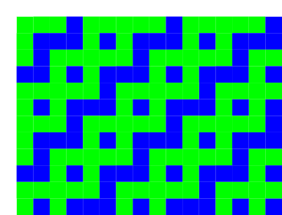

% The Live Loom

---
author: Alex McLean <<alex@slab.org>>,	Deutsches Museum, Munich
header-includes: |
    \usepackage{caption}
    \usepackage{subcaption}
	\usepackage{wrapfig}
...

# Introduction

*Live coding* is the exploratory practice of changing code while it
runs. A live coder uses a programming language as a live interface to
a running process, and therefore its inputs and outputs. This allows
the programmer to participate in the performing arts, for example to
create live coded music, video or dance. Live coding may be used to
refer to any use of code in any kind of live situation, but for the
purposes of this paper, we will focus on live coding as live
improvisation, where code is written without a fixed aim, often from a
notional 'blank slate'.

*Weaving* is a textile craft, where parallel threads known as the
*warp* are held under tension, allowing a second set of threads known
as the *weft* to be passed over and under the warp threads to create
a textile fabric.

This paper investigates how live coding and weaving can be brought
together, looking for ways to ground the contemporary practice of live
coding in the ancient craft of weaving.

# Background

This work is situated within the ERC PENELOPE project lead by Ellen
Harlizius-Klück, against the background of her work exploring the
computational nature of weaving
[e.g. @harlizius_kluck_ellen_2017_3342554]. The aims of the overall
PENELOPE project are to explore weaving as a technical mode of
existence, and to re-establish its place in the history of science and
technology. Within this context, the present paper looks to explore
the relation between live coding and improvisation at the loom, with
the longer term goal to help communicate the complex nature of weaving
structures.

The connection between textile craft and computation has been very
well explored in the digital arts and beyond. However, as
@mccallum_glitching_2018 notes, this work does not always engage
deeply with the structure or history of textiles. McCallum's own work
explores the notion of 'glitch' in media art and how it transfers to
textiles, but given that the latter has developed over a far longer
period than the former, it is not surprising that along the way he
finds much that media art can learn from textiles.

*Stitching Worlds* is a recent, far reaching project imagining a world
where textiles more overtly formed the basis of contemporary
electronic technology [@kurbak_stitching_2018]. Works produced from
this project include the "Embroidered Computer" with Irene Posch and
collaborators, a working 8-bit computer embroidered in gold. This work
integrates textile electromechanical relays into a fabric,
demonstrating that a feminist approach to linking textiles with
computing goes far beyond metaphor - textiles can compute.

In the weaving industry, the technology of computer-controlled looms
is of course also well developed. In the present work we are
interested in analogies with live coding, so interested in 'hands-on'
computer control, which is not afforded by machine looms, where the
human weaver is replaced by a machine. However, hand-operated computer
controlled looms *do* exist, and the present work is much inspired by
the looms designed by Vibeke Vestby and manufactered by Digital
Weaving Norway, including experiments conducted on the TC1 loom in
Textiles Zentrum Haslach, Austria [@mclean_fabricating_2018]. 

# Setting aside the Jacquard machine

The Jacquard machine is a well known device for individual control of
threads in the weaving process, classically through the use of punch
cards. From across computer science and popular culture, the Jacquard
machine is often invoked as part of an 'origin story' of computation,
following Charles Babbage's mention of it as an influence. However, the
Jacquard machine does not *do* computation, it is merely a mechanism
for accepting input data. The Jacquard machine therefore brings a
fundamental misunderstanding to the topic of weaving and computation
which is very difficult to work around.

Yes, weaving is computational, and yes, the Jacquard machine allowed
abstract data to be fed into that computation. But the same
computational nature is present in all weaving, including traditions
of hand weaving developed over millennia. The computation was already
there before Jacquard, and by helping automate the weaving process,
his device only takes humans further away from that computation. So
while Jacquard's machine is often given as an example of the beginning
of the relationship between weaving and computing the opposite is
true - it was an end.

So let's try to wipe the Jacquard machine from our minds in the
following discussion, not because the technology isn't interesting and
useful, but because the discussion around it is so full of
misunderstanding. Once we do that, we are able to see that such
machinery did not introduce any computation to weaving - the
computation was there already. As will become evident in this paper,
the computation is not in the machine, but in the weave.

# Introducing the live loom

Having set one mechanism aside, I introduce another. The Live Loom is
a warp-weighted loom, with solenoids attached so that warp threads may
be individually picked from software. First I explain the technology
of the warp-weighted loom, and later explain the electro-mechanical
attachments on the live loom.

The primary purpose of any loom is to hold a group of parallel
threads, the *warp*, in parallel and under tension, allowing *weft*
threads to be woven over and under the warp threads. The warp-weighted
loom is an ancient technology, where tension comes from the effects of
gravity, by attaching weights to the bottom of the warp threads. By
contrast, on modern looms warp threads are generally horizontal, and
held in tension through mechanical means. The essential components of
a warp-weighted loom are therefore very simple, consisting of a frame
holding two horizontal bars in place, one to hang the warp from,
another below separating alternate threads, keeping them in order, and
creating a potential gap (using weaving terminology, the *natural
shed*) for the weft to pass through by default. The simplicity of the
loom is also its advantage - the simpler the loom, the fewer
constraints and therefore more possibilities there are to weave
complex structures on it.

\centering

\begin{figure}[!h]
\begin{subfigure}[t]{0.33\textwidth}
\includegraphics{plain-draft.png}
\end{subfigure}
\begin{subfigure}[t]{0.33\textwidth}
\includegraphics{twill-draft.png}
\end{subfigure}
\begin{subfigure}[t]{0.33\textwidth}
\includegraphics{satin-draft.png}
\end{subfigure}
\begin{subfigure}[t]{0.33\textwidth}
\includegraphics{plain-weave-a.png}
\end{subfigure}
\begin{subfigure}[t]{0.33\textwidth}
\includegraphics{twill-weave-a.png}
\end{subfigure}
\begin{subfigure}[t]{0.33\textwidth}
\includegraphics{satin-weave-a.png}
\end{subfigure}
\begin{subfigure}[t]{0.33\textwidth}
\includegraphics{plain-weave-b.png}
\end{subfigure}
\begin{subfigure}[t]{0.33\textwidth}
\includegraphics{twill-weave-b.png}
\end{subfigure}
\begin{subfigure}[t]{0.33\textwidth}
\includegraphics{satin-weave-b.png}
\end{subfigure}

\caption{\label{fundamental}Fundamental weave structures, shown with binary 'draft' structure (top), simulated weave with light warp and dark weft (middle), and simulated weave with alternating light and dark warp and weft (bottom). These different structures lead to different physical properties and therefore uses (Emery, 2009).}
\end{figure}

\flushleft

The weaving process involves a weft thread going over and under the
warp threads, following one of a very large range of possible
patterns, for example creating tabby, twill or satin structures
([@emery_primary_2009], see also Fig. \ref{fundamental}). Selective
warp threads are pulled forward, creating a new gap or shed between
the pulled and non-pulled warp threads, through which the weft travels
in a straight line. When the warp threads are returned, the weft is
trapped inside, and the next shed is prepared.

\begin{figure}
\begin{center}
\includegraphics[width=0.48\textwidth]{wwl.png}
\end{center}
\caption{\label{liveloom}The Live Loom, a warp-weighted loom, with live-codable heddles via solenoid actuators.}
\end{figure}

## Weaving technology

The Live Loom is shown in Figure \ref{liveloom}. Although it carries a
contemporary 'maker' aesthetic due to its lasercut plywood
construction, at its core, it is a handloom following an ancient
warp-weighted loom design. The additional electro-mechanical parts do
not replace the core functions of the loom, but rather augment them in
order to allow threads to be selected using a computer language as
well as directly by hand. The hardware and software design are
available as open hardware/free software [@alex_mclean_kairotic/liveloom:_2019].

The live loom is fitted with a number of solenoids (currently
sixteen), mounted on two axes to double the number that could
otherwise fit in a given space. The solenoids are controlled by an
arduino microcontroller, via a bank of relays. When activated, each
relay will push against a stick, which pulls its corresponding warp
thread forward via a string. In this paper we refer to the wooden
stick and string collectively as the *heddle*. With each solenoid
controlling one warp thread, the resulting weave is currently
constrained to sixteen threads across.

Crucially, these solenoid movements are *not* designed to fully create
a shed. Instead this movement only 'offers up' warp threads to the
human weaver-coder, who then pulls the threads further by hand. This
seems like a deficiency of power and leverage, but is not; this
'offering up' means the weaver can choose whether or not to pull each
thread. This is particularly useful at the edges of the weave, where
adjustments are often required to produce a good fabric. 

The suggestive nature of instructions sent via the solenoids reminds
of the live coding choreographic work of @Sicchio14. We can think of
this process as not directly live coding a textile weave, but instead
suggesting bodily movements to produce the weave. When live coding
people rather than computers, it is humane to respect their ability to
exercise creativity and agency in the way they interpret instructions
given to them.

# Computing a weave

Before introducing a language for live coding the loom, lets first
look closer at the computational nature of weaving itself, focussing
on colour and weave effects. Such effects bring together different
dimensions or systems. Firstly, the structure of the weave - the
arrangement of ups and downs in the grid created by the meeting points
of warp and weft. Secondly, the colour patternings of warp and weft
threads. The visible colour at a particular point of the weave then
depends on two things - whether the warp or weft thread is visible
(i.e. whether the weft is under or over the warp) and what colour that
thread is. The result is an interference pattern between these two
systems, creating a deterministic, logical outcome that is nonetheless
very difficult for the layperson to predict.

As a simple example of this, consider the weave structure shown in
Fig. \ref{draft}, known as a draft pattern.  The central black-and-white
grid shows the pattern of weft ups and downs represented as white and
black squares respectively. For example, the first row shows a weft
thread going under one warp, over two warps, and repeat. The second
row shows a weft thread going under two warps, over one warp, and then
repeating.

There are also coloured squares at the top and bottom, showing the
pattern of warp and weft colours respectively, in this case both
alternating between light green and dark blue. In order to find what
colour will be visible, we look at the weave structure. For black
squares, we know the warp colour is shown, so we follow the column up
to find its colour, otherwise we follow the row the left. ^[In
practice, there are other variables which change which colour thread
is visible, for example if weft threads are tightly packed, warp
threads are hidden completely.] From this we can see that where warp
and weft meet with a matching colour (in this case, every other cell
in a checkerboard pattern), the visible colour cannot be changed by
the structure. This is analogous to the Moire effect seen by placing
one net over another, with the visible result being the interference
of the upper and lower structures.

\centering

{width=33%}
{width=33%}
{width=33%}
\begin{figure}[!h]

\begin{subfigure}[t]{0.333\textwidth}
\caption{\label{draft}Draft pattern}
\end{subfigure}
\begin{subfigure}[t]{0.333\textwidth}
\caption{\label{result}Result}
\end{subfigure}
\begin{subfigure}[t]{0.333\textwidth}
\caption{\label{actual-result}Actual result}
\end{subfigure}
\caption{\label{draft-result}A draft pattern and the result of virtually and actually weaving it.}
\end{figure}

\flushleft

If we plot out the result of this interference between thread colour
and weave structure, we arrive at the image shown in Fig. \ref{result}. This
result will be surprising to a layperson, not only is the vertical and
horizontal stripe of warp and weft not visible, but the diagonal runs
in a different direction to the underlying weave structure. This
experience will be familiar to those who have explored algorithmic
interference patterns in livecoding software such as TidalCycles or
Hydra, simple inputs often create unexpected, more complex results.

Finally, Fig. \ref{actual-result} shows a fabric woven using this
structure and alternating white and blue threads, created by a
workshop visitor on the live loom. The same features hold in the weave
itself, although are not too well defined, due to interaction between
the threads, and variation in density. The left and right edges are a
mess, because in practice such a structure simply cannot be woven at
the edges. Weft threads generally travel from left to right for one
row, and from right to left on the next. Therefore, if a weft ends a
row over a warp, and begins the next row also over a warp, then it
will not be woven at that point. A more experienced weaver would make
consistent changes at the edges (known as the *selvage*), such as
adding some rows of plain weave, to ensure a coherent result.

The above description of colour and weave effects should give us pause
for thought. Weaving predates computer programming and indeed discrete
mathematics in general, but nonetheless is a logical, discrete and
therefore digital computational system. Furthermore, any handloom
affords exploration of this system. When considering the computational
nature of weaving then, we must be careful not to be dazzled by the
machinery or electronics of industrial and contemporary weaving
technology, when it is the ancient technology of the threads
themselves that provides the environment for computation.

# Coding the draft

We have already seen that weaving drafts are a form of code, which can
compute unexpected results when interpreted. Such weaving drafts are
themselves binary, digital images, developed well before electronic
digital computers. It is therefore straightforward to add a further
level of abstraction by using a programming language to create a
draft. The purpose of doing so is to create patterns from patterns,
making a rich space to explore weaving and gain tacit knowledge both
about how it works, and its relation to computation as it is more
conventionally understood in the context of programming
languages. Each such layer of abstraction takes us further away from
the material, but just as live coding of music brings together the
experience of coding and listening, the live loom brings together
coding with seeing and touching.

Fig \ref{screenshots}. shows the current version of the live loom coding
interface. The code is shown on the left, using the visual live coding
interface Texture [@McLean11], originally designed as an exploratory
interface for the TidalCycles environment, but here repurposed for a
system designed for discrete, binary draft patterns. The set of
available symbols and keywords are on the top right, which may be
dragged into the code using a mouse. On the bottom right a window into
the draft pattern is shown, with the row most recently being sent to
the live loom marked with blue squares on either side. Finally the row
number is written below, which in this case is higher than the number
of rows shown, as the previous rows have scrolled off the top. The
weaver-coder can manipulate the code with a mouse, while using arrow
keys on a keyboard to step forwards (or backwards) through the draft,
sending each warp lift to the loom to be actuated by the solenoids and
woven by the weaver.

Perhaps most notable is what is *not* shown in the software
interface. In particular, simulation of thread colour (such as that
shown earlier) could easily be included, but is not, indeed thread
colour is not dealt with at all in the software, only on the
loom. Keeping colour on the loom takes focus away from any simulation
on screen and places it in the 'ground truth' of the material. After
all, colour is only one quality of thread, alongside thickness,
material, ply, tightness and direction of twist, tension and density
of warp and weft, and so on. Trying to simulate all of these
continuous variables on-screen would be an insurmountable task, and
focussing the software on the singular task of planning the discrete
structure of ups and downs works very well.

## Live loom language

The language currently used by the Live loom is the pure functional
programming language *Haskell*, using its list datatype. Standard
Haskell lists are 'lazily evaluated', which means that infinitely long
lists can be represented and calculated on demand. A weave structure
is simply represented by a one dimensional list of Boolean values,
where *true* and *false* stands for *up* and *down* (or if you prefer,
*over* and *under*).

The current number of functions for composing draft patterns on the
live loom is small but already provide a very rich space of
possibility. The weaver-coder begins with a list of ups and downs,
then applies functions to transform that list and/or combine it with
other lists. The following table describes the values, functions and
operators available in the live loom code interface.

| name         | description                                                            |
|--------------|------------------------------------------------------------------------|
| []           | An empty list                                                          |
| :            | Adds a value to a list                                                 |
| up / down    | Keywords representing the boolean values of up (over) and down (under) |
| cycle        | Repeats a list forever (standard Haskell function)                     |
| backforth    | Reverses every other row                                               |
| offset n     | Offsets each row from the last, by the given number of threads         |
| shift        | Shifts each row by one thread                                          |
| rev          | Reverses each rows                                                     | 
| every n f    | Selectively applies function f to every nth row                        |
| invert       | Turns all ups to downs, and vice versa                                 |
| zipAnd a b   | Combines two lists, resulting in up when both lists have an up         |
| zipOr a b    | Combines two lists, resulting in up when one or both lists has an up   |
| zipXOr a b   | Combines two lists, resulting in up when only one lists have an up     |

The result is a language interface that produces surprisingly complex
results from simple elements.

# Working at the Live Loom

Figure \ref{caroline-draft} shows the live loom software interface
next to the woven outcome. This starkly shows the perceptual gap
between code, draft and weave, with little visual correspondance
despite the structures of the draft being a logical outcome from the
code, and the weave being that of the draft. The code is represented
as a branching tree, the visual interface directly showing the
branching normally represented by parenthesis [@McLean11]. This
particular code creates the draft pattern shown, which perhaps has the
appearance of vines growing up a wall. When this structure interferes
with the alternating colours of warp and weft, the final result
appears in the weave as (to my eyes) legs leaping into the air
(Fig. \ref{caroline-result}).

\begin{figure}[!h]

\begin{subfigure}[t]{0.692\textwidth}
\includegraphics{caroline-draft.png}
\caption{\label{caroline-draft}Code (left) and resulting draft structure (bottom right)}
\end{subfigure}
\begin{subfigure}[t]{0.308\textwidth}
\includegraphics{caroline.png}
\caption{\label{caroline-result}Resulting weave}
\end{subfigure}
\caption{Live loom software interface and the woven result}
\end{figure}

It is humbling that this logical leap from draft to weave constitutes
ancient knowledge, demonstrating mathematical logic while predating
our conventional view of mathematics. This brings historical grounding
to the analogous logical leap from code to draft, shown alongside.

## Music of the loom

The solenoids are not triggered at once but in sequence, to even out
the use of electrical power, with less needed to hold a solenoid than
to move it. The most time-efficient way to do this would be to trigger
the 'up' threads, pulling the warps one after the other, evenly spaced
in time. However I have found it much more useful to include 'down'
threads in the timing, so each row takes the same amount of time to
actuate, no matter how many warps are being pulled forward. This gives
a clear rhythm to each row, where the 'clunk' of a solenoid is heard
for an up, and a silent pause is heard for downs. This rhythm breathes
life into the weaving process, making it easier to orient myself in
the pattern and spot errors, as I compare the rhythm I hear with the
threads I see. It also brings rhythmic enjoyment to the repetitive nature
of weaving, compelling me forward into the next row.

The solenoids have a particular 'duty cycle', meaning that it is best
not to keep them activated for too long, otherwise they may
overheat. Once all the solenoids are activated, the microcontroller
holds them in place for a few seconds, giving enough time for the
weaver to place a hand on the heddles and pull the selected warp
threads forward. Although born from a technical need, these few
seconds add an additional sense of regulated timing to the process of
weaving. However if the heddles are not caught in time, the
weaver-coder can repeat the lift with a quick press of the up arrow
key. The weaver can also unweave by stepping backwards through the
structure with the left arrow, removing rather than adding the weft by
hand, for each step.

# Live Coding

So far we have discussed action, but not live reaction. We have looked
at coding the loom with a draft, and coding the coding of the loom by
introducing a language for composing a draft, but we haven't discussed
live coding - the changing of code in response. Let's do that now.

## Changing patterns

Live coding of music is often characterised by comparatively slow,
continuous changes. Changes are heard immediately, but the complexity
of music grows with the code. The experience of the live loom is
rather different, where a small change tends to have a large, global
effect, but each change takes time to become apparent; rows are only
produced at a rate of a few per minute, and it might take two or three
repeats of a pattern before its nature can really be felt.  These
big differences from small edits are due to the multiple levels of
interference, between code, draft and weave.

A change from one pattern to the next also presents a problem of
transition, where one pattern might not sit well with the next,
potentially creating a physically uneven structure, with undesireable
floats (see below). It can take a disturbed row or two before the
weave settles into the next structure. There are certainly parallels
here with live coding music and indeed music in general, where a
sudden change can be jarring, without a careful transition. Managing
this transition is probably best done at the loom, adjusting each shed
at the heddles by hand.

At this slow pace of change though, we are in the domain analogous to
slow coding rather than frenzy of an algorave. Where each decision has
long term consequences, there is a need for careful
consideration. Furthermore in weaving we work with physical thread,
rather than with the metaphorical thread of time as with live coding
of music. This means that we are able to undo a weave in a way that we
cannot undo music, and change our minds. By unweaving, the weaver,
like the mythological figure of Penelope, resists external forces.

## Embracing error

Live coders are known for embracing error, and so it is fortunate that
it is so easy to produce a draft which is unweavable. For example,
there is the problem of 'floats', lengths of unwoven fibre created
wherever there is a contiguous series of either ups or downs in the
warp or weft direction. Indeed, where there are only either ups or
downs in a given row or column, that thread will not be woven into the
fabric at all. In response to a problematic draft the weaver can do
one of three things - change the code to look for a more weavable
draft, ignore activated heddles or pull additional ones to change the
weave directly, or just attempt to weave the pattern anyway.

In the above example, the draft looked unweavable to my naive eyes,
due to the pairs of identical rows within it. Where this happens,
pairs of consecutive wefts are passed through the same shed. I thought
this would result in a mess, but out of curiosity went ahead anyway,
and found that with care the wefts would still run parallel and stay
in order, largely maintaining the 'correct' structure
on-screen. Furthermore, because the repeat in the draft consists of an
odd number of rows, and I was weaving with two different wefts, the
wefts would alternate between either travelling from one side to the
other together, or travelling in opposite directions. By embracing
this error I arrived at a (to me) surprising, pleasing, and subtle
result, although there are undoubtedly many such surprises on the way
to becoming an experienced weaver, and I have far to go.

## Weaving the edit

Decisions at the live loom are taken slowly, responding to problems
and opportunities as they arise in the weave. Figure
\ref{screenshots}(a) shows the starting point for another improvised
weave, a draft appearing to be a kind of hatched vertical pattern,
drifting to the left, with lines sometimes joining or breaking. When
it came to weaving this structure, two features slowly became apparent
-- the pervasive pairs of ups and downs on the weft, offset from one
row to the next, seemed to result in the warp spreading out
vertically, and therefore partially hiding the warp at points where I
expected it to be visible. This created an a partly *weft-faced*
weave. However, some long floating threads were present on the warp
direction, and the weft-facing only accentuated the presence of these
long warps lying on top.

\begin{figure}[!h]

\begin{subfigure}[t]{0.33\textwidth}
\includegraphics{improv-a.png}
\caption{}
\end{subfigure}
\begin{subfigure}[t]{0.33\textwidth}
\includegraphics{improv-b.png}
\caption{}
\end{subfigure}
\begin{subfigure}[t]{0.33\textwidth}
\includegraphics{improv-c.png}
\caption{}
\end{subfigure}
\begin{subfigure}[t]{0.33\textwidth}
\includegraphics{improv-d.png}
\caption{}
\end{subfigure}
\begin{subfigure}[t]{0.33\textwidth}
\includegraphics{improv-e.png}
\caption{}
\end{subfigure}
\begin{subfigure}[t]{0.33\textwidth}
\includegraphics{improv-f.png}
\caption{}
\end{subfigure}

\caption{\label{screenshots}Screenshots of Live Loom interface at six different points in the weaving of fabric (see Fig. \ref{float-result}).}
\end{figure}

After weaving 20 rows of this pattern (Fig. \ref{float-result}a), I
hit a snag - the pattern of repeating warp floats drifted until they
sat at both edges of the fabric, seen in Fig. \ref{screenshots}(b). I
realised that having floats at the selvage would cause the textile to
lose its otherwise uniform width, and I decided I neither wanted this
effect or to change it by hand; I had been enjoying working the two
wefts together at the selvage, and felt that having a warp float there
would create a mess. So instead I changed the structure to that seen
in \ref{screenshots}(c), adding code to invert every other row, as an
effort to break up warp floats. However, after a few rows of weaving
the edit (Fig. \ref{float-result}b) to the point in the interface
shown in Fig. \ref{screenshots}d, I realised that by breaking up some
floats, I had only created new ones. Another tweak shown in
Fig. \ref{screenshots}(e), this time changing a number from
\ref{screenshots} to 1, seemed to fix it. However once I started
weaving I realised the floats were still there, but now so long that
they took up the whole edge and so were no longer visible on-screen.

\begin{figure}[!h]
  \begin{center}
    \includegraphics[width=0.3\textwidth]{float.pdf}
  \end{center}
  \caption{\label{float-result}Result of improvised weave edits shown in Fig \ref{screenshots}}
\end{figure}

This time I decided having such long floats was an interesting enough
challenge to pursue, and embraced this compounded error as an
opportunity to experiment more with creating extra binding points at
the selvage by hand. I continued with this structure for 53 rows, up
until the point seen in Fig. \ref{screenshots}(f).  The resulting
weave shown in \ref{float-result}c did indeed turn out to be
interesting, the resulting weave curiously appearing to be much more
coherent than the draft pattern. As the long threads stepped one warp
to the left, they cycled between white and blue, over a steep
diagonal. This time, the resulting motif reminded me of quipu knots.

The resulting experimental weave we have seen in Fig. \{float-result}
charts an experiment in three stages. First, the initial serendipitous
discovery of a) a weft-faced structure with warp floats. Then
transition b) as I searched for a solution to a perceived problem at
the selvage. Finally a longer section c), with some manual
experimentation at the selvage. The resulting fabric tells a story of
its making, from a starting point, to prevaracation and decision, with
further learning points charted along the edge as I learned to deal
with the selvage.

# Feminist alternative history

Comparing the contemporary practice of live coding with the ancient
craft of handweaving has potential to support and extend a somewhat
obscured feminist history of computation. Feminist perspectives on
computing and weaving hardly new, a well-known reference point being
Sadie Plant's influential text "Zeros and Ones: Digital Women and the
New Technoculture" [@plant_zeros_1998]. However, the once dominant
role of women in computer programming has been steadily erased since
the 1960s and '70s [@hicks_programmed_2017], and despire recent
efforts, gender diversity in software engineering is an ongoing
problem.

As a relatively new interdisciplinary practice, live coding offers an
opportunity to build a gender diverse culture, and this opportunity is a
core topic across live coding research and practice
[@armitage_spaces_2018]. Turkle and Papert related gender to the plurality of
relationships between coder and program observed in children,
describing a more conversational approach to coding, with mid-course
corrections rather than fixed-goals as *bricolage* [@Turkle90,
p. 136]. This approach is certainly evocative of live coding, with the
suggestion being that it is one likely to be favoured by girls, but
discouraged by instructors in favour of more fixed design processes.

@armitage_spaces_2018 brings together female perspectives on live
coding in the Algorave scene, relating one interviewee's experience of
live coding "... as a way of working through their daily life, adding
structures to it and providing functions for being. These lived
patterns merge with their daydreams and expressions of colour and
geometry to form her live coded visuals." [@armitage_spaces_2018,
p. 39]. This again evokes Turkle and Papert's bricoleur, and indeed
the social and intellectual function of weaving in building a personal
cosmos [@harlizius_kluck_ellen_2017_840005].

# Conclusion

This paper has explored how the principles of live coding may apply to
the warp-weighted loom. However, in connecting a live coding pattern
language to the practice of weaving, we find that weaving is already
abundant with computational patterns, and in particular that
historical drafting techniques already demonstrate a similar
computational abstraction from the resulting woven textile as code
does from media in the live coded performing arts. Nonetheless by
adding another layer of abstraction to that which has been present in
weaving since ancient times, and using solenoids in communicating
movement from the code to the weaver, the live loom allows creative
exploration of woven patterns in a way that is sympathetic to the
repetitive, yet cognitive nature of handweaving.

There is much to follow the preliminary work introduced here. This
paper has purposefully focussed on understanding of weave from the
perspective of live coding, taking care to have respect for this
ancient craft. It could be however that weaving practice could benefit
from such a computer language interface. Whereas 

# Acknowledgements

I am grateful for all the input and feedback from colleagues and
workshop participants in this work.

This research is conducted by the PENELOPE project, with funding from
the European Research Council (ERC) under the Horizon 2020 research
and innovation programme of the European Union, grant agreement No
682711.

# References
